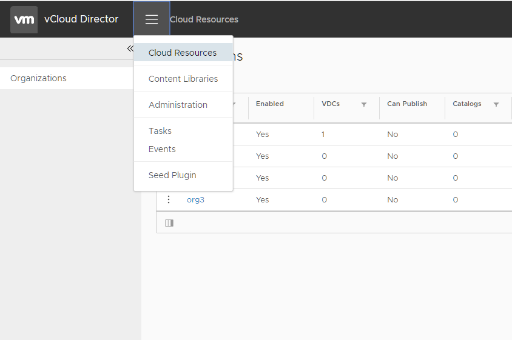
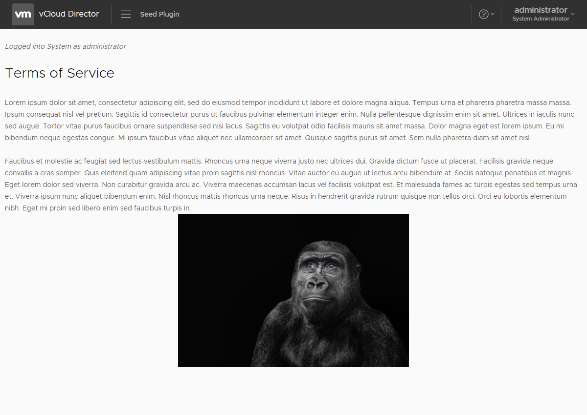

# Quick Start
{: .no_toc }

## Table of contents
{: .no_toc .text-delta }

1. TOC
{:toc}

---

## Prerequisites
UI Plugins rely heavily on the [Angular UI Platform](https://angular.io/){:target="_blank"} and [Clarity](https://clarity.design/){:target="_blank"}–VMware's own HTML/CSS framework and set of Angular components. Familiarity with these frameworks is essential tobuilding and understanding vCloud Director UI plugins. A basic understanding of the Node/NPM build system and Webpack is also beneficial. Node and NPM should be installed prior to building the plugin.

## Plugin Seed Project
[View in GitHub](https://github.com/vmwaresamples/vcd-ext-samples/tree/plugin-seed-9.1){:target="_blank"}{: .btn .btn-primary }

The plugin seed project is a fully functional UI plugin that can be registered with a vCloud Director instance and used in either the tenant or provider portal.

The seed showcases the basic functionality a plugin would leverage, including:
* Injecting vCD-specific tools
* Exposing an extension point to the top level navigation of vCD
* Calling vCD APIs
* Accessing data from the UI host
* Embedding static resources in a plugin
* Internationalization

This seed project works with version 9.1.0.2, 9.5.x and 9.7.x of vCloud Director.

### Building
The seed plugin can be built by cloning the repository and issuing NPM build commands.
```bash
git clone -b plugin-seed-9.1 --single-branch https://github.com/vmwaresamples/vcd-ext-samples.git
cd vcd-ext-sdk

# install project dependencies
npm ci

# build plugin
npm run build
```
The end result of running these commands is a `plugin.zip` file in the `dist/` directory. This file can now be registered as a vCD UI plugin.

### Installing
> add install instructions here

### Viewing the Plugin
Once the plugin has been successfully registered and uploaded, there should be a new menu option in vCloud Director's top-level navigation menu:


Selecting the 'Seed Plugin' menu option will route the UI to the plugin content"

